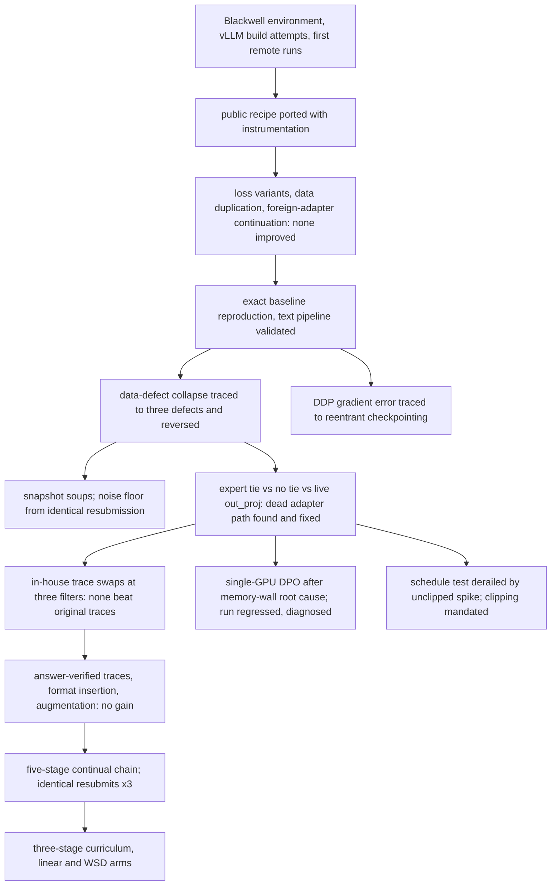

# Nemotron-3-Nano Reasoning Adapter: Methodology and Engineering Record

An applied research program on improving the reasoning accuracy of NVIDIA Nemotron-3-Nano-30B-A3B under a fixed evaluation protocol, with a rank-32 LoRA adapter as the only trainable artifact. This repository records the method: protocol, data engineering, training and evaluation infrastructure, diagnostics, and experiment lineage.

## 1. Problem

| | |
|---|---|
| Model | Nemotron-3-Nano-30B-A3B: hybrid Mamba-2 / attention / 128-expert MoE, about 30B parameters, 3B active, bf16 |
| Task | Six families of few-shot inductive puzzles: bit manipulation, symbolic equations (numeric and cryptarithm), substitution ciphers, numeral systems, unit conversion, gravitational constant |
| Deliverable | PEFT LoRA adapter, rank at most 32. No code runs at inference, so every procedure must live in the weights |
| Decoding | Greedy, 7,680 generated tokens, 8,192 context |
| Metric | Exact match on the final boxed answer; numeric within 1 percent; no partial credit |
| Compute | One rented RTX PRO 6000 (96 GB); two for specific parallelism tests |

The protocol originated in a public challenge, which fixed the metric and constraints.

## 2. Method

1. **Reconnaissance first.** Metric code, data, and architecture characterized before modeling; the scorer reimplemented locally so every generator self-scores (`01_data/ANSWER_EXTRACTION.md`).
2. **Exact baseline reproduction** to byte-identical data and matching step-1 loss before any change.
3. **One variable per run,** preceded by a stress test on worst-case sequences that also asserts gradient flow to every adapter module. Append-only logs, gradient clipping, resumable checkpoints, fixed-fraction adapter snapshots.
4. **Root cause before fix:** byte-level adapter audits, log forensics, per-category output analysis. Base model files never modified.
5. **Verifiable training data:** deterministic solvers emit step-by-step traces in a controlled vocabulary; synthetic puzzles are solved blind and kept only when the planted answer is recovered; corpora pass independent reviewer audits that recompute every step (`01_data/HOW_TO_*.md`).
6. **Hypothesis, method, outcome, verdict** logged per run in `study/SCORE_TRACKER.md`, appended without revision.

Operational steps were executed by coding agents on remote instances under the written routines (`02_train/TRAINING_ROUTINE.md`, `03_eval/EVAL_ROUTINE.md`), which is why the routines are specified for an operator with no context.

## 3. Lineage

Seventy-eight experiment directories in `study/`, each self-contained. The pivotal runs:



## 4. Findings

1. **A dead adapter path.** The Mamba output-projection LoRA never received gradients: the fused CUDA kernel consumed the base weight. Routing that module through the model's native unfused path at training time was the largest recipe-level gain of the program. `02_train/260522_moe_expert_rank1_bug_report.md`
2. **Rank collapse in expert adapters.** A library layout change flipped the axis a weight-tying operation averaged over, collapsing per-expert factors to rank 1. Corrected tying then proved harmful; independent per-expert adapters were adopted. Same report.
3. **Three small data defects, one large collapse.** A brace-truncating extractor, stray characters in 704 rows, and one malformed row degraded categories they did not touch; fixing them fully restored the run. `study/2605141458_sft_huikang_golden_rtx6000/260514_2003_submission/EVALUATION.md`
4. **The trace is the signal.** Answer-only targets collapsed accuracy; swapping trace style never beat the reference traces regardless of filtering; inserting a verification block regressed; continuing a foreign adapter on a new format destroyed it.
5. **bf16 beats 4-bit on 96 GB.** With cut cross-entropy the 16 GB logits tensor never materializes, so bf16 used less memory and ran faster than 4-bit with standard cross-entropy. `02_train/260514_4bit_investigation_report.md`
6. **DDP penalty was a checkpointing bug.** Reentrant gradient checkpointing produced wrong gradients under DDP; the non-reentrant path matched single-GPU step-1 gradients to four decimals, and adapter-drift analysis showed no remaining penalty. `study/2605231435_sft_moe_outproj_ddp_rtx6000/2605231810_submission/EVALUATION.md`
7. **Non-determinism is a first-class variable.** Byte-identical runs diverge from the fourth decimal of the first gradient norm; byte-identical submissions score differently; gradient spikes are benign at near-zero learning rate and destructive at peak. Clipping at 1.0 and repeated submissions became mandatory.
8. **Weight averaging did not beat the best endpoint.** Last-k averaging sat within noise, early-late interpolation hurt, and cross-trajectory SVD merges lost mass to rank-32 re-truncation. `02_train/260515_checkpoint_selection_report.md`
9. **Preference optimization.** A 46-test memory wall was a cross-entropy patch bypassing the framework's gradient checkpointing, inflating activations ninefold; a gradient-decomposition DPO then fit, but regressed on 72 percent near-identical pairs and an adapter path active at inference yet inert in training. `02_train/DPO_FOUNDATIONS.md`
10. **Curriculum needs replay.** Continual fine-tuning with fresh optimizer state reached the parent recipe where single-shot training on the same data did not; down-sampling saturated categories to 15 percent caused forgetting. `study/2606122226_Curriculum Training/`


## 5. Repository

```
00_resource/   notes on the model family and tooling; data-gathering scripts
01_data/       category guides, solver and generator code, corpus audits, EDA
02_train/      training routine, technical reports, root-cause analyses, DPO and RL studies
03_eval/       evaluation routine and scripts, metric analysis, output investigations
study/         one directory per experiment: script, stress test, run record, findings
```

Read in this order: the two routines, `study/SCORE_TRACKER.md`, then any single experiment directory.

## 6. Technology Stack

| Layer | Stack |
|---|---|
| Model and fine-tuning | Nemotron-3-Nano-30B-A3B in bf16; Unsloth with PEFT LoRA, rank 32, on attention, Mamba in and out projections, MoE experts, and the LM head; a custom PyTorch training loop with cut cross-entropy in place of materialized logits; native mamba-ssm and causal-conv1d kernels; transformers 4.56, PyTorch 2.8, CUDA 12.8 on Blackwell |
| Early exploration | bitsandbytes NF4 QLoRA and TRL SFTTrainer on an RTX 5090 and on Kaggle kernels, before the move to the custom loop |
| Parallelism | torchrun DDP across two GPUs with non-reentrant gradient checkpointing |
| Preference optimization and RL | single-GPU DPO by gradient decomposition in the same loop; a GRPO reward stack designed against TRL GRPOTrainer with vLLM rollouts |
| Weight averaging | rank-constrained SVD merges of LoRA snapshots over safetensors |
| Data engineering | deterministic Python solvers and trace generators; blind-solve augmentation with planted answers; tokenizer-level collision checks; pandas for corpus builds; multi-agent audit workflows |
| Evaluation | vLLM greedy decoding on Kaggle kernels at the task's settings; the production extractor and verifier reimplemented; API harnesses for reference models |

## 7. Disclaimer

Disclosed: methodology, routines, project-authored code with credentials removed, run records with their local evaluation results, the experiment log with the metric score of every submitted solution, the local leaderboard, and reports.

Withheld: the puzzle corpus and everything derived from it, all weights, competition standings such as leaderboard position, medal, or comparison with other participants, and credentials.

Copyright © 2026 Jerry Huang. All rights reserved.
